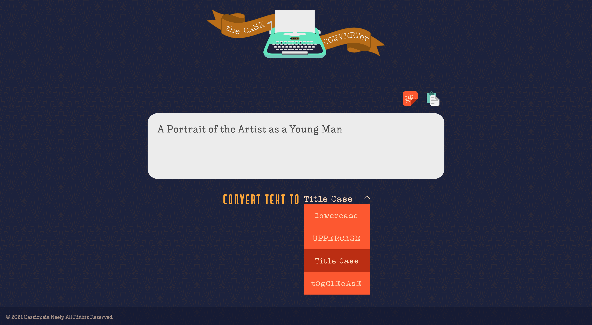
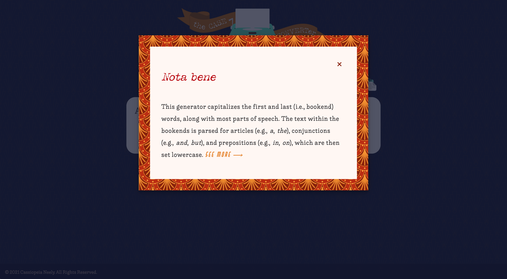

# Case Converter

## Table of Contents
 
 + [Introduction](#introduction)
 + [Features](#features)
    - [Invert Togglecase Text](#invert-togglecase-text)
    - [Intuitive Title Case Functionality](#intuitive-title-case-functionality)
    - [Title Case Note](#title-case-note)
    - [Animation](#animation)
    - [Click to Copy Text](#click-to-copy-text)
 + [Favicon](#favicon)
 + [Inspiration](#inspiration)
 + [Tech Specs](#tech-specs)
 + [Poetry Credit](#poetry-credit)

 ## Introduction

 

 Have you ever gone to capitalize one letter, then realized YOU’VE ACCIDENTALLY STARTED YELLING? Do you want to bE a LiTtLe SaRcAsTiC without all the effort? [Case Converter](https://cassiopeian.github.io/case-converter) can update text to UPPERCASE, lowercase, Title Case, or tOgGlEcAsE, with one click.

## Features 

 ### Invert Togglecase Text

 

 When text is converted to togglecase, the *Invert Case* button will appear beside the clipboard icon. This gives you the ability to convert the example text:

 > sHaLl I cOmPaRe ThEe To A sUmMeR'S dAy?

 to

 > ShAlL i CoMpArE tHeE tO a SuMmEr's DaY? 

 ### Intuitive Title Case Functionality

 

 Title cased text is mostly capitalized, but there are a few rules. This generator capitalizes the first and last (i.e., bookend) words in a given string of text, along with all major nouns and verbs. The text within the bookends is parsed for articles (e.g., *a*, *the*), conjunctions (e.g., *and*, *but*), and prepositions (e.g., *in*, *on*), which are lowercased.

 ### Title Case Note

 

 ### Animation

 

 When a case is selected from the dropdown, a busy little paper airplane carries your request from the converter to the mint typewriter.

 ### Click to Copy Text 

 

 Copy your converted text, with one click, by selecting the clipboard icon. A little notification will flash above the icon, to let you know that the text has been copied to your device’s clipboard.

## Favicon

 

 Since this project is all about typing, a typewriter seemed like the perfect symbol. I wanted it to be modern and bright, so I chose to make it mint green. 

## Inspiration 

 It TaKeS fOrEvEr to type in togglecase on mobile devices. I knew there were built-in JavaScript methods to transform text to uppercase and lowercase, so I wanted to challenge myself to create a togglecase converter. 

## Tech Specs

 Case Converter was built with jQuery version 3.6.0.

## Poetry Credit

 The excerpts featured in the screenshots, above, were drawn from poems. 

 > Shall I compare thee to a summer's day?
 
 from "Sonnet XVIII" | William Shakespeare

 > And it grew both day and night.  
 > Till it bore an apple bright.  
 > And my foe beheld it shine,  
 > And he knew that it was mine. 

 from "A Poison Tree" | William Blake 

 > You must come to them sideways  
 > In rooms webbed in shadow,  
 > Sneak a view of their emptiness  
 > Without them catching  
 > A glimpse of you in return.  

 from "Mirrors at 4 a.m." | Charles Simic
